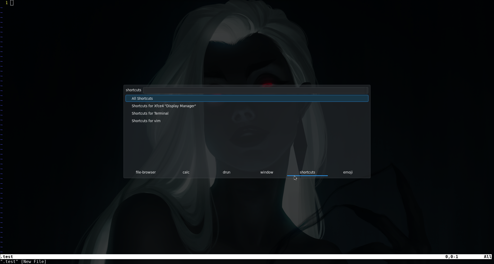
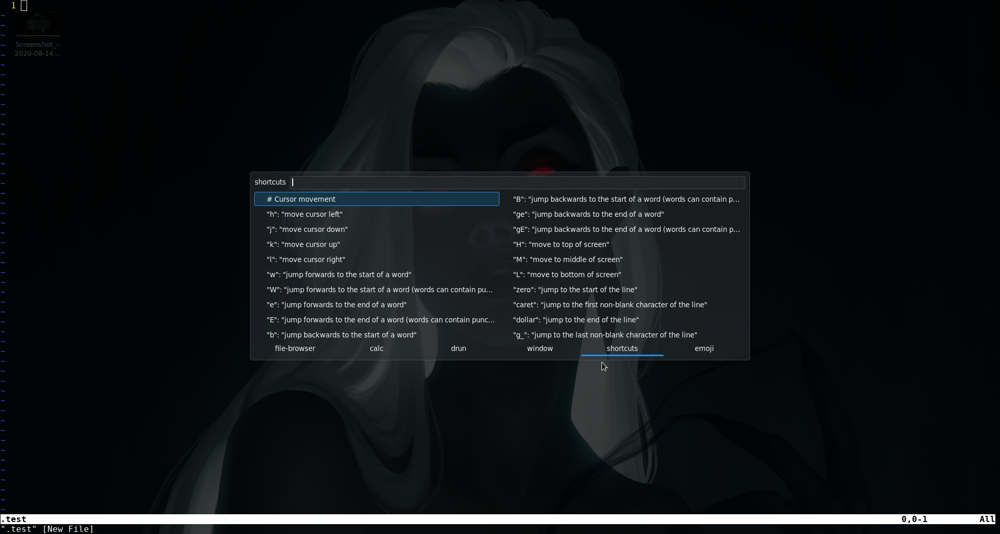

# Short-Rofi

[![][License]][L-link]
![][Version]

This Projeck is based off "https://github.com/davatorium/rofi"

This script put out shortcuts about the active programm. 

## Screenshots
 

## How to add to rofi:
`git clone https://github.com/AndeAndreas31415/Short-Rofi.git $HOME/.config/rofi/`
 
`chmod +x $HOME/.config/rofi/rofi-shortcuts.sh`	

### Run this script from Cli (*Terminal*)

`rofi -modi shortcut:$HOME/.config/rofi/rofi-shortcut.sh -show shortcut`

### Add the script to rofi modi 

Edit the *config from rofi*:

​	`nano $HOME/.config/rofi/config.rasi`
or
​	`vim $HOME/.config/rofi/config.rasi`
or 
​	`$"Your favorit text editor" $HOME/.config/rofi/config.rasi`

add in the line "modi":
  <u>shortcuts:$HOME/.config/rofi/rofi-shortcuts.sh</u> 

Example:
   *modi: "drun,window,shortcuts:/home/anno/coding/bash-script/short_rofi/rofi-shortcut.sh,";*

ToDo:
- automatic key press
- add more cheat sheet

<!-- Variables for this Readme file-->
[License]: https://img.shields.io/badge/License-MIT-blue
[Version]: https://img.shields.io/badge/Version-Alpha-red
[L-link]: ./LICENSE
